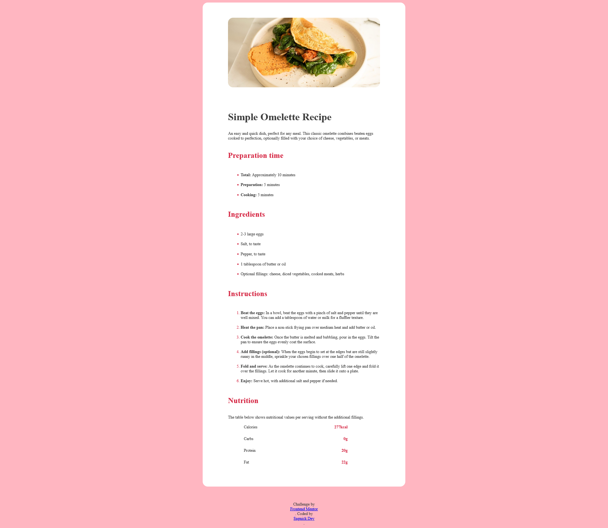

# Frontend Mentor - Recipe page solution

This is a solution to the [Recipe page challenge on Frontend Mentor](https://www.frontendmentor.io/challenges/recipe-page-KiTsR8QQKm). Frontend Mentor challenges help you improve your coding skills by building realistic projects. 

## Table of contents

- [Overview](#overview)
  - [The challenge](#the-challenge)
  - [Screenshot](#screenshot)
  - [Links](#links)
- [My process](#my-process)
  - [Built with](#built-with)
  - [What I learned](#what-i-learned)
  - [Continued development](#continued-development)
  - [Useful resources](#useful-resources)
- [Author](#author)

## Overview

This is a simple recipe page that contains a recipe card . The page design is responsive in both laptop,pcs and mobiles (Design is as per their given instructions)

### Screenshot

### Links

- Solution URL: [Add solution URL here](https://your-solution-url.com)
- Live Site URL: [Add live site URL here](https://your-live-site-url.com)

## My process

### Built with

- Semantic HTML5 markup
- CSS custom properties
- Flexbox
- Mobile-first workflow

### What I learned

Beautiful example to test my css skills it taught me 
- How to build cards like this
- How to make design responsive
- How to style list-styles using '::marker' pseudo-element.

### Continued development

-I'll focus on making more responsive designs in future

### Useful resources

- [Example resource 1](https://www.google.com) - To learn about ::marker pseudo-element google's AI mode helped me a lot , it saved my time what i'ld have wasted on searching and browsing through pages of pages of long docs.

## Author

- Frontend Mentor - [@SagnickDey427](https://www.frontendmentor.io/profile/SagnickDey427)
- LinkedIn - [Sagnick Dey](https://www.linkedin.com/in/sagnick-dey-712017334/)

